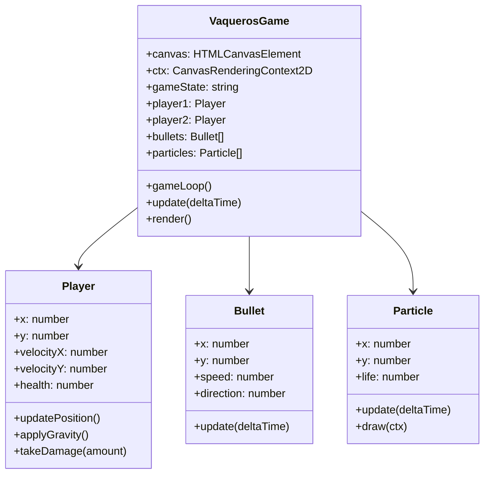

# 📚 Documentación Técnica - Duelo de Vaqueros

## 🎯 Resumen Ejecutivo

Este documento detalla la implementación técnica de **"Duelo de Vaqueros"**, un videojuego 2D desarrollado en JavaScript que demuestra la aplicación práctica de los **12 Principios de Animación de Disney** en el desarrollo de videojuegos web. El proyecto combina programación orientada a objetos, física de juegos, y técnicas avanzadas de animación para crear una experiencia de usuario inmersiva y educativa.

## 🏗️ Arquitectura del Sistema

### Patrón de Diseño Utilizado
El proyecto implementa el patrón **Entity-Component-System (ECS)** simplificado, donde:
- **Entidades**: Jugadores, proyectiles, partículas
- **Componentes**: Posición, velocidad, sprites, estados
- **Sistemas**: Física, renderizado, input, colisiones

### Estructura de Clases



## 🎨 Implementación de los 12 Principios de Animación

### 1. **Squash and Stretch** (Compresión y Estiramiento)

**Ubicación**: `Player.updateSquashStretch()`, `VaquerosGame.drawPlayer()`

**Implementación Técnica**:
```javascript
updateSquashStretch() {
    if (this.grounded && Math.abs(this.velocityY) > 10) {
        // Compresión al aterrizar
        this.squashStretch = Math.min(0.5, Math.abs(this.velocityY) / 20);
        this.squashStretchTimer = 200;
    } else if (!this.grounded && this.velocityY < -5) {
        // Estiramiento al saltar
        this.squashStretch = -Math.min(0.3, Math.abs(this.velocityY) / 30);
    }
}

// En drawPlayer()
ctx.scale(
    1 + player.squashStretch * 0.2,    // Escala horizontal
    1 - player.squashStretch * 0.3     // Escala vertical
);
```

**Resultado Visual**: Los personajes se comprimen visiblemente al aterrizar y se estiran al saltar, creando una sensación de peso y elasticidad.
### 7. **Arc** (Arco)

**Ubicación**: Física de salto y proyectiles

**Implementación Técnica**:
```javascript
// Salto con trayectoria en arco
jump() {
    if (this.grounded) {
        this.velocityY = this.jumpPower; // -15
        this.grounded = false;
    }
}

// Proyectiles con física balística
class Bullet {
    update(deltaTime) {
        // Movimiento horizontal constante
        this.x += this.speed * this.direction * (deltaTime / 16);
        
        // Gravedad afecta trayectoria vertical
        this.velocityY += 0.3;
        this.y += this.velocityY;
    }
}
```

**Resultado Visual**: Saltos y proyectiles siguen trayectorias curvas naturales, no líneas rectas.

### 8. **Secondary Action** (Acción Secundaria)

**Ubicación**: Sistema de partículas, efectos visuales

**Implementación Técnica**:
```javascript
createJumpParticles(player) {
    for (let i = 0; i < 5; i++) {
        const particle = new Particle(
            player.x + Math.random() * player.width,
            player.y + player.height,
            'dust'
        );
        particle.velocityX = (Math.random() - 0.5) * 4;
        particle.velocityY = Math.random() * -3;
        this.particles.push(particle);
    }
}

createHitEffect(player) {
    for (let i = 0; i < 10; i++) {
        const particle = new Particle(
            player.x + player.width / 2,
            player.y + player.height / 2,
            'spark'
        );
        // Partículas radiales
        const angle = (i / 10) * Math.PI * 2;
        particle.velocityX = Math.cos(angle) * 6;
        particle.velocityY = Math.sin(angle) * 6;
        this.particles.push(particle);
    }
}
```

**Resultado Visual**: Efectos de partículas que complementan las acciones principales sin distraer de ellas.

### 9. **Timing** (Tiempo)

**Ubicación**: Gestión de deltaTime, velocidades variables

**Implementación Técnica**:
```javascript
gameLoop() {
    const now = performance.now();
    const deltaTime = now - (this.lastTime || now);
    this.lastTime = now;
    
    this.update(deltaTime);
    this.render();
    requestAnimationFrame(() => this.gameLoop());
}

// Velocidades variables para diferentes elementos
createBullet(player) {
    const bullet = new Bullet(/*...*/);
    // Variación en velocidad para mayor dinamismo
    bullet.speed += (Math.random() - 0.5) * 2;
}
```

**Resultado Visual**: Diferentes elementos se mueven a velocidades apropiadas, creando jerarquía visual.

### 10. **Exaggeration** (Exageración)

**Ubicación**: Screen shake, knockback, efectos de impacto

**Implementación Técnica**:
```javascript
createBullet(player) {
    // Screen shake exagerado para disparo
    this.screenShake = 8;
    this.canvas.classList.add('shake');
    setTimeout(() => this.canvas.classList.remove('shake'), 500);
}

applyKnockback(direction) {
    // Knockback exagerado
    this.velocityX += direction * 10;
    this.velocityY -= 5; // Levanta ligeramente del suelo
    
    // Efecto visual amplificado
    this.squashStretch = 0.6;
    this.squashStretchTimer = 300;
}

updateScreenEffects() {
    if (this.screenShake > 0) {
        const shakeX = (Math.random() - 0.5) * this.screenShake;
        const shakeY = (Math.random() - 0.5) * this.screenShake;
        this.ctx.translate(shakeX, shakeY);
        this.screenShake -= 0.5;
    }
}
```

**Resultado Visual**: Efectos amplificados que transmiten el impacto de las acciones de manera memorable.

### 11. **Solid Drawing** (Dibujo Sólido)

**Ubicación**: Sprites, perspectiva del fondo

**Implementación Técnica**:
```javascript
drawPlayer(player) {
    // Dibujar sombra para dar sensación de volumen
    this.ctx.fillStyle = 'rgba(0, 0, 0, 0.3)';
    this.ctx.beginPath();
    this.ctx.ellipse(
        player.x + player.width / 2,
        this.height - 55,
        player.width / 2,
        8,
        0, 0, Math.PI * 2
    );
    this.ctx.fill();
    
    // Sprites con proporções correctas y perspectiva
    if (image && image.complete) {
        this.ctx.drawImage(
            image,
            -player.width / 2,
            -player.height / 2,
            player.width,
            player.height
        );
    }
}
```

**Resultado Visual**: Personajes con volumen y peso visual, sombras que los conectan con el suelo.

### 12. **Appeal** (Atractivo)

**Ubicación**: Diseño general, paleta de colores, feedback visual

**Implementación Técnica**:
```javascript
// Paleta de colores atractiva en CSS
:root {
    --primary-color: #8B4513;    // Marrón western
    --accent-color: #FFD700;     // Dorado brillante
    --sky-blue: #87CEEB;         // Azul cielo atractivo
}

// Feedback visual inmediato
updateUI() {
    // Barras de vida con colores dinámicos
    const healthPercent1 = (this.player1.health / 100) * 100;
    const healthPercent2 = (this.player2.health / 100) * 100;
    
    // Color cambia según la vida restante
    const color1 = healthPercent1 > 60 ? '#4CAF50' : 
                   healthPercent1 > 30 ? '#FF9800' : '#F44336';
    
    document.getElementById('player1HealthBar').style.background = color1;
}
```

**Resultado Visual**: Interfaz atractiva, colores consistentes con la temática western, feedback claro.

## 🔧 Sistemas Técnicos Avanzados

### Motor de Físicas Personalizado

```javascript
class PhysicsEngine {
    static applyGravity(entity, deltaTime) {
        if (!entity.grounded) {
            entity.velocityY += entity.gravity * (deltaTime / 16);
            entity.velocityY = Math.min(entity.velocityY, entity.maxFallSpeed);
        }
    }
    
    static checkCollisions(rect1, rect2) {
        return rect1.x < rect2.x + rect2.width &&
               rect1.x + rect1.width > rect2.x &&
               rect1.y < rect2.y + rect2.height &&
               rect1.y + rect1.height > rect2.y;
    }
    
    static resolveCollision(entity, ground) {
        if (entity.y + entity.height > ground) {
            entity.y = ground - entity.height;
            entity.velocityY = 0;
            entity.grounded = true;
        }
    }
}
```

### Sistema de Estados de Juego

```javascript
class GameStateManager {
    constructor() {
        this.states = {
            MENU: 'menu',
            PLAYING: 'playing',
            PAUSED: 'paused',
            GAME_OVER: 'gameOver'
        };
        this.currentState = this.states.MENU;
    }
    
    setState(newState) {
        this.currentState = newState;
        this.onStateChange(newState);
    }
    
    onStateChange(state) {
        switch(state) {
            case this.states.MENU:
                this.showMainMenu();
                break;
            case this.states.PLAYING:
                this.startGame();
                break;
            case this.states.PAUSED:
                this.pauseGame();
                break;
            case this.states.GAME_OVER:
                this.showGameOver();
                break;
        }
    }
}
```

---

*Documentación técnica desarrollada por [Maxcerva12](https://github.com/Maxcerva12) para el proyecto académico "Duelo de Vaqueros"*
  - Proporciones consistentes

### 12. **Appeal** (Atractivo)
- **Ubicación**: Diseño general del juego
- **Implementación**:
  - Interfaz atractiva con gradientes
  - Efectos visuales llamativos
  - Paleta de colores del oeste americano
  - Animaciones fluidas y satisfactorias

## Controles del Juego

### Jugador 1 (Vaquero Izquierdo)
- **A**: Mover izquierda
- **D**: Mover derecha  
- **W**: Saltar
- **J**: Disparar

### Jugador 2 (Vaquero Derecho)
- **Flecha Izquierda**: Mover izquierda
- **Flecha Derecha**: Mover derecha
- **Flecha Arriba**: Saltar
- **1**: Disparar

## Características Técnicas

- **Resolución**: 1000x600 píxeles
- **FPS Target**: 60 FPS
- **Tecnología**: HTML5 Canvas + JavaScript
- **Física**: Motor de física personalizado
- **Sonido**: Web Audio API (cuando agregues los archivos)

## Instrucciones de Ejecución

1. Asegúrate de que todos los archivos estén en su lugar
2. Abre `index.html` en un navegador web moderno
3. El juego se iniciará automáticamente
4. ¡Disfruta del duelo de vaqueros!

